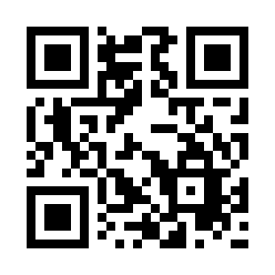

# 🖼️ Generate QR Code

A Java Cloud Function to generate QR code for the given text.

```
http://localhost:3000/?text=https://github.com/open-runtimes
```

_Example output:_




_Error Example output:_

```json
{
  "success": false,
  "message": "Required fields are not present: text"
}
```

## 📝 Environment Variables

This function does not require any variables.

## 🚀 Deployment

1. Clone this repository, and enter this function folder:

```
$ git clone https://github.com/open-runtimes/examples.git && cd examples
$ cd java/generate_qr_code
```

2. Build the code using Docker:
```
docker run -e OPEN_RUNTIMES_ENTRYPOINT=Index.java --rm --interactive --tty --volume $PWD:/mnt/code openruntimes/java:v4-8.0 sh helpers/build.sh
```
As a result, a `code.tar.gz` file will be generated.

3. Start the Open Runtime:
```
docker run -p 3000:3000 -e OPEN_RUNTIMES_SECRET="" --rm --interactive --tty --volume $PWD/code.tar.gz:/mnt/code/code.tar.gz:ro openruntimes/java:v4-8.0 sh helpers/start.sh "java -jar /usr/local/server/src/function/java-runtime-1.0.0.jar"
```

Your function is now listening on port `3000`, and you can execute it using curl request with appropriate authorization headers. To learn more about runtime, you can visit Java runtime [README](https://github.com/open-runtimes/open-runtimes/tree/main/runtimes/java-18.0).

4. In a new terminal window, execute function:

```
curl http://localhost:3000/?text=https://github.com/open-runtimes
```

## 📝 Notes
- This function is designed for use with Appwrite Cloud Functions. You can learn more about it in [Appwrite docs](https://appwrite.io/docs/functions).
- This example is compatible with Java 18.0. Other versions may work but are not guaranteed to work as they haven't been tested.
